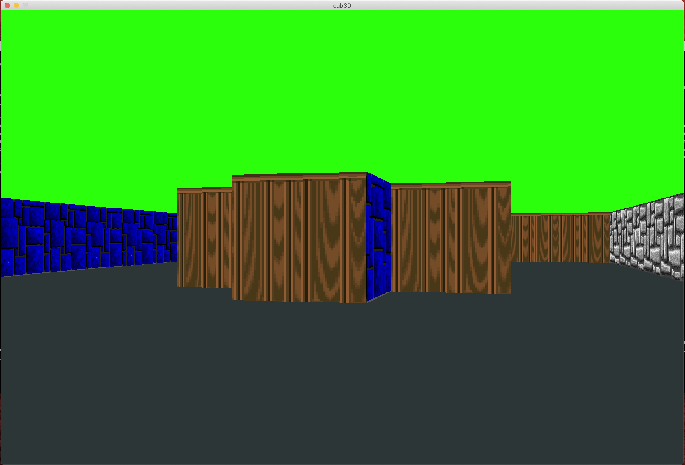
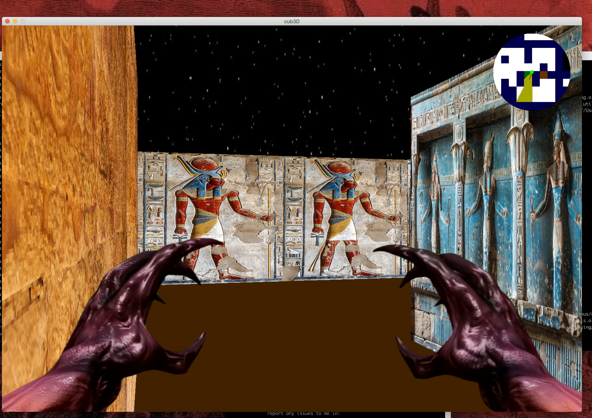
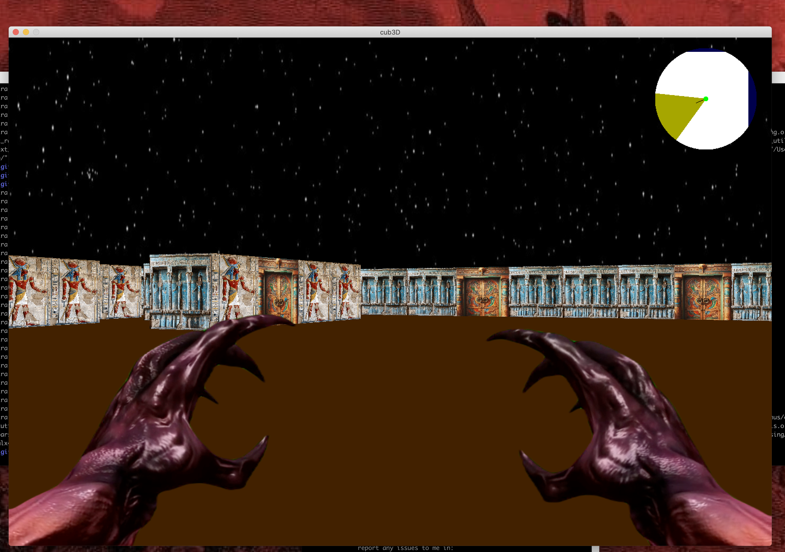

# cub3D
---
Cub3D is a mini 3D game project that uses raycasting to render a 3D environment from a 2D map, inspired by Wolfenstein 3D

## introdction
___
The __Cub3D__ is a simple 3D game engine that starts from a 2D to 3D view using raycasting. The project focuses on the principles of raycasting, allowing the player to navigate through a maze-like world and interact with walls. The goal of the project is to provide students with hands-on experience in game development, graphics programming, texture mapping, colors, and rendering.

## Features
___
- `Raycasting` for 3D rendering.
- `control` Custom player controls (moves and rotate).
- `collision` Dynamic wall collision detection.
- `Textures` Accept textures for walls with different sizes.
- `Mini-map` display
- `Doors` functionality
## Requirements
___
 - *mini-libx* this project use mlx library for graphics rendering
 - *cc* compiler collection
 - *GNU Makefile* For compile the project

 ## Installation Instructions
 ---
1. Clone the repository: `git clone https://github.com/YOUSSEFLJ9/cub3D_1337_42.git`
2.  Navigate to the project directory: `cd cub3d`
3. You need to build mlx library , you can read how to from here: 
            `https://github.com/codam-coding-college/MLX42`
4. Run `make` or `make bonus` to compile project

## Usage
---
1. Run the program by providing a map file . cub format : 
```bash
./cub3D maps/map.cub              #for mandatory part
./cub3D_bonus maps/map_bn1.cub    #for bonus
```
  In the map file .cub:

+ __1__ represents a wall.
+ __0__ represents empty space.
+ __D__ represents a door.
+ __S E W N__ represents player position, where :
    * _S_ : Player starts facing South.
    * _E_: Player starts facing East.
    * _W_: Player starts facing West.
    * _N_: Player starts facing North.
* The map configuration also includes texture paths for the walls, defined as follows:

    - NO: Path to the texture for the north-facing wall.
    - SO: Path to the texture for the south-facing wall.
    - WE: Path to the texture for the west-facing wall.
    - EA: Path to the texture for the east-facing wall.

* The map also defines the colors for the floor and ceiling in RGB format:
    - F: Floor color
    - C: Ceiling color
#### Example:

```NO textures/tx_1.png
SO textures/tx_2.png
WE textures/tx_3.png
EA textures/tx_4.png

F 16, 16, 255
C 135, 206 , 235
```
## Control
---
- `W` or `up` / `A` / `S` or `down` / `D` : Move forward/left/backward/right.
- Arrow keys : Rotate camera :  `left` and  `right`.
- `Esc` : Exit the game.
- `O` / `D` open and close the door.
- `E` / `X` activate mouse rotation / disable.
- `W` + `SHIFT` running forward.
## Preview





## Contributors
- [youssefLJ9](https://github.com/YOUSSEFLJ9)
- [DraGSsine](https://github.com/DraGSsine)
## Resources
- [medium](https://ismailassil.medium.com/ray-casting-c-8bfae2c2fc13)
- [medium](https://medium.com/@abdelhadi-salah/ray-casting-cub3d-bb5d99de742d
)